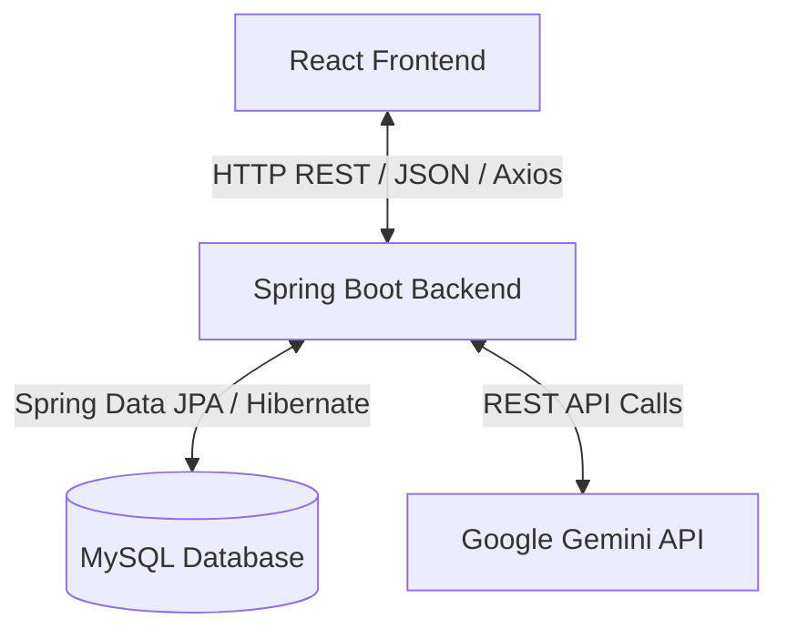
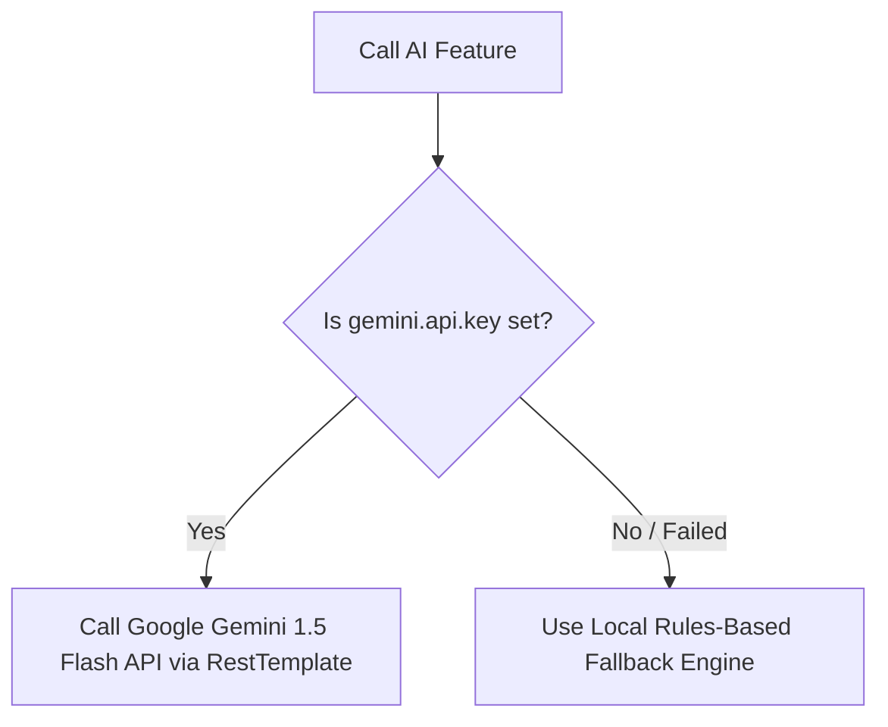

# Hospital Review System - Project Guide & Study Reference
## 📂 Project Architecture Overview

The system is built on a modern **three-tier client-server architecture**:

1. **Frontend Tier (React + Vite)**: Renders the user interfaces (Home, Review Submission, Department Filter, and Admin Dashboard). Communicates with the backend using **Axios** to send and retrieve JSON payloads.
2. **Backend Tier (Spring Boot)**: Contains controllers (REST endpoints), services (business logic and AI integration), and repositories (data access objects).
3. **Database Tier (MySQL)**: Persists tables for `departments`, `patients`, and `reviews`.

---

## 🛠️ Technology Stack

| Component | Technology | Role in Project |
| :--- | :--- | :--- |
| **Frontend** | **React** (v19) | Component-based UI rendering. |
| **Build Tool (FE)** | **Vite** | Modern, ultra-fast local bundler and dev server. |
| **API Client** | **Axios** | Sends HTTP requests (GET, POST, PUT, DELETE) to the backend. |
| **Icons** | **Lucide React** | Premium icon set for UI visual indicators. |
| **Backend** | **Spring Boot** (v3.3.0) | Handles REST APIs, business logic, and security. |
| **Data Access** | **Spring Data JPA** | Abstracts SQL queries using Java Interfaces. |
| **ORM** | **Hibernate** | Maps Java Entities to MySQL database tables. |
| **Database** | **MySQL** | Permanent relational data storage. |
| **AI Engine** | **Google Gemini 1.5 Flash** | Generates realistic reviews and performs sentiment analysis. |

---

## 🗄️ Database Schema & Entities

The database contains three main tables managed by Hibernate.

### 1. `Department` Entity (`de0partments` table)
Represents the medical departments in the hospital.
* **Fields**:
  - `departmentId` (Long, PK, Auto-Increment): Unique ID.
  - `departmentName` (String, Unique, Not Null): E.g., Cardiology, ENT, Pediatrics, Orthopedics, Dermatology.

### 2. `Patient` Entity (`patients` table)
Represents registered patients.
* **Fields**:
  - `patientId` (String, PK): Custom ID format (e.g., `P101`, `P102`).
  - `patientName` (String, Not Null): Full name of the patient.
  - `age` (Integer): Patient's age.
  - `gender` (String): E.g., Male, Female, Other.
  - `doctorName` (String, Not Null): Doctor who treated the patient.
  - `departmentId` (FK): Many-to-One relationship referencing `departments(department_id)`.
  - `visitDate` (LocalDate): Date of the visit.

### 3. `Review` Entity (`reviews` table)
Represents patient reviews and sentiments.
* **Fields**:
  - `reviewId` (Long, PK, Auto-Increment): Unique ID.
  - `patientId` (FK): Many-to-One relationship referencing `patients(patient_id)`.
  - `rating` (Integer, Not Null): Star rating from `1` to `5`.
  - `review` (String, Length=1000, Not Null): Written review text.
  - `sentiment` (String): AI-determined sentiment (`Positive`, `Neutral`, or `Negative`).
  - `createdAt` (LocalDateTime, Not Null): Timestamp when the review was created/edited.

---

## 🔌 API Endpoints (Backend REST APIs)

All endpoints reside under the base path `/api`.

### 1. Departments (`/api/departments`)
* `GET /api/departments` - Returns a list of all departments.
* `GET /api/departments/stats` - Returns overall statistics: total reviews, average hospital rating, sentiment breakdown count (Positive/Neutral/Negative), and review statistics per department.

### 2. Patients (`/api/patients`)
* `GET /api/patients/{patientId}` - Fetches patient info by ID (used to auto-fill review submission).
* `POST /api/patients` - Registers a new patient.

### 3. Reviews (`/api/reviews`)
* `GET /api/reviews` - Fetches all reviews ordered by creation date descending.
* `GET /api/reviews/department/{departmentId}` - Fetches reviews filtered by department.
* `POST /api/reviews` - Submits a review. Triggers sentiment analysis before saving.
* `PUT /api/reviews/{reviewId}` - Edits an existing review's text and rating, and recalculates its sentiment.
* `DELETE /api/reviews/{reviewId}` - Deletes a review.
* `POST /api/reviews/ai-generate` - Accepts `{ departmentName, doctorName, rating }` and returns a generated review.

---

## 🤖 AI Logic & Local Fallback Engine

The system uses a **hybrid AI model** inside `ReviewServiceImpl.java`:

### A. Review Generation Logic
* **Gemini API**: Prompts the model to act as a patient writing a realistic review matching the rating stars (positive for 5, mixed for 3, negative for 1-2 stars), kept under 3-4 sentences.
* **Local Fallback**: Uses pre-defined arrays of templates (grouped by rating star 1-5). It picks a random template and interpolates the doctor's name and department name.

### B. Sentiment Analysis Logic
* **Gemini API**: Prompts the model to return exactly one word: `Positive`, `Neutral`, or `Negative`.
* **Local Fallback**: Scans the review text for a lists of positive/negative keywords:
  - **Positive words**: *excellent, great, good, satisfied, wonderful, friendly, professional, amazing, cured, best, clean, helpful, recommend*
  - **Negative words**: *bad, worst, poor, terrible, dissatisfied, rude, slow, unhelpful, dirty, crowded, delayed, expensive, painful, ignore*
  - It scores the text (`+1` for positive, `-1` for negative). If there is a tie, it falls back to the rating:
    - Rating $\ge 4$: `Positive`
    - Rating $= 3$: `Neutral`
    - Rating $\le 2$: `Negative`

---

## 🖥️ Frontend Structure & Pages

The user interface is designed with a premium, clean design and includes:
1. **Home Page (`Home.jsx`)**: Welcoming landing area introducing the portal.
2. **Review Submission Page (`ReviewSubmission.jsx`)**: 
   - Enter Patient ID (e.g. `P101`). If found, it fetches the details.
   - If not found, prompts the user to register the patient.
   - Allows selecting a rating (1-5 stars).
   - Features a **"✨ Generate AI Review"** button that fills the text box automatically using the backend AI generator.
3. **Department Reviews (`DepartmentReviews.jsx`)**: Allows users to filter and read reviews by specific departments.
4. **Admin Dashboard (`AdminDashboard.jsx`)**:
   - Top stats cards: Total Reviews, Average Rating, Positive Sentiment rate.
   - Interactive charts: Sentiment breakdown (Progress Bars) and Departmental performance breakdown.
   - CRUD actions: Admin can edit or delete any review.

---

## ❓ Common Viva & Interview Questions

### Q1. How does React connect to the Spring Boot backend?
**Answer:** Through HTTP REST endpoints. We configure a base URL (`http://localhost:8081/api`) inside our Axios config (`api.js`). When a page loads or form submits, Axios makes asynchronous requests (e.g., `axios.get` or `axios.post`) and processes the returned JSON data to update the React component state.

### Q2. What is CORS and how did you configure it?
**Answer:** CORS stands for **Cross-Origin Resource Sharing**. By default, web browsers block frontend code on one port (`http://localhost:5173`) from calling APIs on another port (`http://localhost:8081`). We resolved this by adding the `@CrossOrigin(origins = "*")` annotation on our controllers in Spring Boot, allowing our React frontend to access the endpoints.

### Q3. How does the database get created and seeded?
**Answer:** 
1. In `application.properties`, we configured `createDatabaseIfNotExist=true` inside the JDBC URL to automatically create the `hospital_review` database on start.
2. We used `spring.jpa.hibernate.ddl-auto=update`, which tells Hibernate to automatically create or update tables matching our Java `@Entity` classes on startup.
3. We wrote a `DataInitializer` class implementing `CommandLineRunner`. When the application starts, it checks if `departments` table is empty (`departmentRepository.count() == 0`). If empty, it seeds default departments and mock patients. Otherwise, it skips seeding to prevent duplicates.

### Q4. What is the benefit of the hybrid local fallback engine?
**Answer:** It ensures the application is completely robust and always works. If a user doesn't have an internet connection, has hit rate limits, or didn't set up the Google Gemini API key in `application.properties`, the application seamlessly falls back to local rules-based sentiment analysis and randomized templates so that the UI never breaks.

### Q5. How does Spring Boot handle Dependency Injection?
**Answer:** It uses constructor injection. Classes like `ReviewServiceImpl` declare their dependencies (e.g., `ReviewRepository`, `PatientRepository`) in their constructor, and Spring automatically resolves and injects them (using `@Service` and `@Repository` annotations) during application startup.
